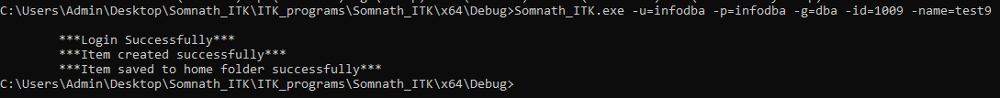
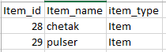
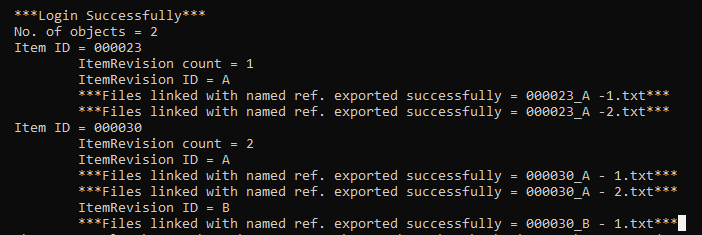
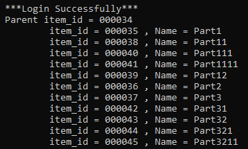

# ITK Batch Utility Programs

This repository contains various ITK batch utility programs for Siemens Teamcenter. The programs demonstrate different operations using ITK in C.

## Available Programs

- **Bulk_file_import.c**
- **Bulk_item_create_through_csv.c**
- **Change_Ownership.c**
- **Create_dataset_and_attach_to_item.c**
- **Create_form_and_attach_to_BO.c**
- **Find_objects_acc_criteria.c**
- **Find_objects_acc_criteria_and_export_its_named_ref_datasets.c**
- **Import_dataset.c**
- **Item_create_in_home_folder.c**
- **Login.c**
- **Print_BOM_line_item_id_Multi_level_childs.c**
- **Query_execute.c**
- **dataset_export.c**

## Program Results & Screenshots

Below are screenshots showing the results of running these utilities, extracted from the documentation:

### Login & Authentication

### Bulk Creation and Item Operations

### Queries and Searching

### Export and BOM Operations

*(Note: The `images` folder is ignored by git to keep the repository clean. It can be re-generated from the PDF documentation).*
