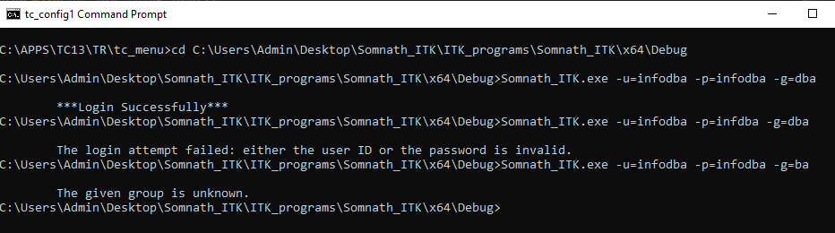
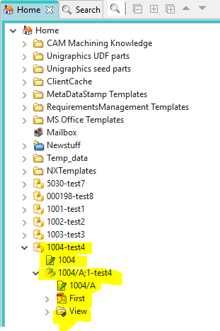
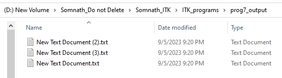
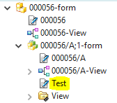
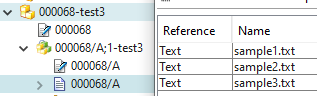

# ITK Batch Utility Programs

This repository contains various ITK batch utility programs for Siemens Teamcenter. The programs demonstrate different operations using ITK in C.

## Available Programs & Results

Below are the utility programs along with screenshots showing the results of running them, extracted from the documentation:

### 1. Login.c

### 2. Item_create_in_home_folder.c

### 3. Create_dataset_and_attach_to_item.c

### 4. Import_dataset.c

### 5. Find_objects_acc_criteria.c

### 6. Find_objects_acc_criteria_and_export_its_named_ref_datasets.c

### 7. dataset_export.c

### 8. Bulk_item_create_through_csv.c

### 9. Bulk_file_import.c

### 10. Print_BOM_line_item_id_Multi_level_childs.c

### 11. Create_form_and_attach_to_BO.c

### 12. Change_Ownership.c

### 13. Query_execute.c

*(Note: The `image` folder contains the result pictures extracted from the documentation PDF).*
